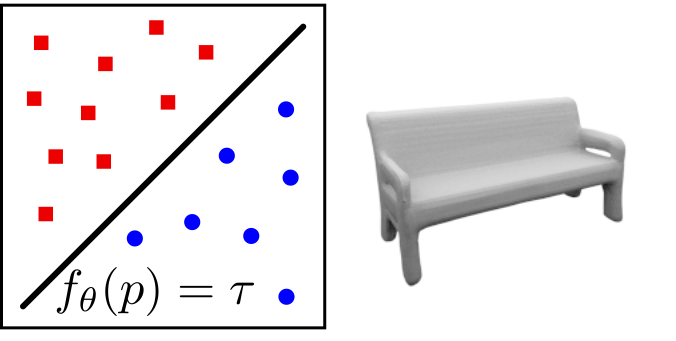

# Introduction
Besides the COVID-19 pandemic and political upheaval in the US, 2020 was also the year in which **neural volume rendering** exploded onto the scene, triggered by the impressive [NeRF](https://www.matthewtancik.com/nerf) paper by Mildenhall et al.
This blog post is my way of getting up to speed in a fascinating and very young field and share my journey with you; I created it for the express intent to teach this material in a grad computer vision course. To be clear, I have not contributed to any of the papers below. I wish I had, as I stand in awe of the explosion of creative energy around this topic!

To start with some definitions, the larger field of *Neural rendering* is defined by the [excellent review paper by Tewari et al.](https://www.neuralrender.com/assets/downloads/TewariFriedThiesSitzmannEtAl_EG2020STAR.pdf) as 
> "deep image or video generation approaches that enable explicit or implicit control of scene properties such as illumination, camera parameters, pose, geometry, appearance, and semantic structure."

It is a novel, data-driven solution to the long-standing problem in computer graphics of the **realistic rendering of virtual worlds**.

**Neural volume rendering** (NRV) refers to methods that generate images or video by tracing a ray into the scene and taking an integral of some sort over the length of the ray. Typically a neural network like a multi-layer perceptron encodes a function from the 3D coordinates on the ray to quantities like density and color, which are integrated to yield an image. Because the input to the neural net is a 3D coordinate, these methods are also sometimes called **coordinate-based** scene representation networks.

Besides this post, the review paper mentioned above is great background, and Yen-Chen Lin, a PhD student at MIT CSAIL, has curated an [Awesome NeRF repository on GitHub](https://github.com/yenchenlin/awesome-NeRF) with papers, bibtex, and links to some talks.

**Important note**: *all of the images below are reproduced from the cited papers, and the copyright belongs to the authors or the organization that published their papers, like IEEE.  Below below I reproduce a key figure for each paper under the fair use clause of copyright law.* 

# The Prelude: Neural Implicit Surfaces

The immediate precursors to neural volume rendering are the approaches that use a neural network to define an **implicit** surface representation. Many 3D-aware image generation approaches used voxels, meshes, point clouds, or other representations, typically based on convolutional architectures. But at CVPR 2019, no less than three papers introduced the use of neural nets as *scalar function approximators* to define occupancy and/or signed distance functions.

## Occupancy networks

[Occupancy networks](https://avg.is.tuebingen.mpg.de/publications/occupancy-networks) is one of two methods at CVPR 2019 that introduce implicit, coordinate-based learning of **occupancy**, i.e., the sign of an SDF. A network consisting of 5 ResNet blocks take a feature vector and a 3D point and predict binary occupancy. They also show single-view reconstruction results on real images from KITTI.

> 
> Occupancy as a learned classifier.
>
> **Occupancy Networks: Learning 3D Reconstruction in Function Space**, Lars Mescheder, Michael Oechsle, Michael Niemeyer, Sebastian Nowozin, and Andreas Geiger, CVPR 2019.

## IM-Net

[IM-NET](https://github.com/czq142857/implicit-decoder) is the second, and uses a 6-layer MLP decoder that predicts binary occupancy given a feature vector and a 3D coordinate. The authors show that this "implicit decoder" can be used for auto-encoding, shape generation (GAN-style), and single-view reconstruction.

> 
> 3D Shapes generated using a GAN using IM-NET as the decoder.
>
> **Learning Implicit 3D Representations without 3D Supervision**, Zhiqin Chen and Hao Zhang, CVPR 2019.

## DeepSDF
Finally, also at CVPR 2019, [DeepSDF](https://github.com/facebookresearch/DeepSDF) directly regresses a **signed distance function** or SDF, rather than binary occupancy, from a 3D coordinate and optionally a latent code. It uses an 8-layer MPL with skip-connections to layer 4 (setting a trend!) that outputs the signed distance.

> 
> The Stanford bunny rendered through a learned signed distance function (SDF).
>
> **DeepSDF: Learning Continuous Signed Distance Functions for Shape Representation**, 	Jeong Joon Park, Peter Florence, Julian Straub, Richard Newcombe, and Steven Lovegrove, CVPR 2019.

## PIFu
Building on this, the ICCV 2019 [PIFu](https://shunsukesaito.github.io/PIFu/) paper showed that it was possible to learn highly detailed implicit models by re-projecting 3D points into a pixel-aligned feature representation. This idea will later be reprised, with great effect, in PixelNeRF.

> 
> PIFu regresses color and an SDF from pixel aligned features, enabling single-view reconstruction.
>
> **PIFu: Pixel-Aligned Implicit Function for High-Resolution Clothed Human Digitization**,	Shunsuke Saito, Zeng Huang, Ryota Natsume, Shigeo Morishima, Angjoo Kanazawa, and Hao Li, ICCV 2019.

## Building on Implicit Functions

Several other approaches built on top of the implicit function idea, and generalize to training from 2D images. Of note are Structured Implicit Functions, CvxNet, Scene Representation Networks, Differentiable Volumetric Rendering, and the Implicit Differentiable Renderer.

Also published at ICCV 2019, [Structured Implicit Functions](https://github.com/google/ldif) showed that you can combine these implicit representations, e.g., simply by summing them.
Another way to combine signed distance functions is by taking a pointwise max (in 3D), as done in [CvxNet](https://cvxnet.github.io/), a paper which has a number of other elegant techniques to reconstruct an object from depth or RGB images.

A [Scene Representation Network or SRN](https://vsitzmann.github.io/srns/) is quite similar to DeepSDF in terms of architecture, but adds a differentiable ray marching algorithm to find the closest point of intersection of a learnt implicit surface, and add an MLP to regress color, enabling it to be learned from multiple posed images.

Similar to the SRN work, the CVPR 2020 [Differentiable Volumetric Rendering](https://github.com/autonomousvision/differentiable_volumetric_rendering) paper shows that an implicit scene representation can be coupled with a differentiable renderer, making it trainable from images. They use the term *volumetric renderer*, but really the main contribution is a clever trick to make the computation of depth to the implicit surface differentiable: no integration over a volume is used.

Finally, the [Implicit Differentiable Renderer](https://lioryariv.github.io/idr/) work from Weizmann presented at NeurIPS 2020 is similar, but have a more sophisticated surface light field representation, and also show that can refine camera pose during training.

# Neural Volume Rendering

As far as I know, two papers introduced volume rendering into the view synthesis field, with NeRF being the simplest and ultimately the most influential.

## Neural Volumes

True **volume rendering** for view synthesis was introduced in the [Neural Volumes](https://research.fb.com/publications/neural-volumes-learning-dynamic-renderable-volumes-from-images/) paper from Facebook Reality Labs (the Pittsburgh lab, led by @subail) regressing a 3D volume of density and color, albeit still in a voxel-based representation.

> 
> In Neural Volumes, a latent code is decoded into a 3D volume, and a new image is then obtained by volume rendering.
>
> **Neural Volumes: Learning Dynamic Renderable Volumes from Images**,	Stephen Lombardi, Tomas Simon, Jason Saragih, Gabriel Schwartz, Andreas Lehrmann, and Yaser Sheikh, Siggraph 2019.

## NeRF 

The paper that got everyone talking, however, was the [Neural Radiance Fields or NeRF paper](https://www.matthewtancik.com/nerf), with three first authors from Berkeley. In essence, they take the DeepSDF architecture and regress not SDF, but density and color, and then use (easily differentiable) Monte Carlo integration to approximate a true volumetric rendering step.

> 
> A NeRF stores a volumetric scene representation as the weights of an MLP, trained on many images with known pose.
>
> 
> New views are rendered by integrating the density and color at regular intervals along each viewing ray.
>
> **NeRF: Representing Scenes as Neural Radiance Fields for View Synthesis**,	Ben Mildenhall*, Pratul Srinivasan*, Matthew Tancik*, Jonathan Barron, Ravi Ramamoorthi, Ren Ng, ECCV 2020.

One of the reasons NeRF is able to render with great detail is because it encodes a 3D point and associated view direction on a ray using a periodic activation functions, an innovation with was later published separately under the acronym [SIREN](https://vsitzmann.github.io/siren/) (SInusoidal REpresentation Networks) at NeurIPS.

While this paper was ostensibly published at ECCV 2020, at the end of August, it [first appeared on Arxiv](https://arxiv.org/abs/2003.08934) in the middle of March, sparking an explosion of interest on twitter. I remember seeing [the video](https://www.youtube.com/watch?v=JuH79E8rdKc) and being amazed at the quality of the synthesized views, but even more so at the incredible detail in the visualized depth maps, e.g., this [Christmas tree](https://storage.googleapis.com/nerf_data/website_renders/depth_ornament.mp4). It is worth visiting [the (elaborate) project site](https://www.matthewtancik.com/nerf) and looking at all the videos. If you're new to NeRF, prepare to be amazed :-)

Arguably, the impact the NeRF paper lies in its brutal simplicity: just an MLP taking in a 5D coordinate and outputting density and color. There are some bells and whistles, notably SIREN and a stratified sampling scheme, but many researchers were taken aback (I think) that such a simple architecture could yield such impressive results. That being said, vanilla NeRF left many opportunities to improve upon:
- It is *slow*, both for training and rendering.
- It can only represent static scenes
- It "bakes in" lighting
- A trained NeRF representation does not generalize to other scenes/objects

In this Arxiv-fueled computer vision world, these opportunities were almost immediately capitalized on, with almost 25 papers appearing on Arxiv over the past 6 months, the vast majority in the last month, even. Below I list all of them I could find, and discuss representative papers in each category.

# Performance
- Implicit Neural Representations with Periodic Activation Functions	Vincent Sitzmann, Julien Martel, Alexander Bergman, David Lindell, Gordon Wetzstein
- Neural Sparse Voxel Fields	Lingjie Liu, Jiatao Gu, Kyaw Zaw Lin, Tat-Seng Sua, Christian Theobalt
- NERF++: ANALYZING AND IMPROVING NEURAL RADIANCE FIELDS	Kai Zhang, Gernot Riegler, Noah Snavely, Vladlen Koltun
- DeRF: Decomposed Radiance Fields	Daniel Rebain, Wei Jiang, Soroosh Yazdani, Ke Li, Kwang Moo Yi, Andrea Tagliasacchi
- GRF: Learning a General Radiance Field for 3D Scene Representation and Rendering	Alex Trevithick, Bo Yang
- AutoInt: Automatic Integration for Fast Neural Volume Rendering	David Lindell, Julien Martel, Gordon Wetzstein
- Learned Initializations for Optimizing Coordinate-Based Neural Representations	Matthew Tancik, Ben Mildenhall, Terrence Wang, Divi  Schmidt, Pratul Srinivasan, Jonathan Barron, Ren Ng

# Dynamics Scenes
- X-Fields: Implicit Neural View-, Light- and Time-Image Interpolation	Mojtaba Bemana, Karol Myszkowski, Hans-Peter Seidel, Tobias Ritschel
- Neural Scene Graphs for Dynamic Scenes	Julian Ost, Fahim Mannan, Nils Thürey, Julian Knodt, Felix Heide
- Deformable Neural Radiance Fields	Keunhong Park, Utkarsh Sinha, Jonathan Barron, Sofien Bouaziz, Dan Goldman, Steven Steven, Ricardo Martin-Brualla
- Space-time Neural Irradiance Fields for Free-Viewpoint Video	Wenqi Xian, Jia-Bin Huang, Johannes Kopf, Changil Kim
- Neural Scene Flow Fields for Space-Time View Synthesis of Dynamic Scenes	Zhengqi Li, Simon Niklaus, Noah Snavely, Oliver Wang
- D-NeRF: Neural Radiance Fields for Dynamic Scenes	Albert Pumarola, Enric Corona, Gerard Pons-Moll, Francesc Moreno-Noguer

# Relighting
- NeRF in the Wild: Neural Radiance Fields for Unconstrained Photo Collections	Ricardo Martin-Brualla, Noha Radwan, Mehdi Sajjadi, Jonathan Barron, Alexey Dosovitskiy, Daniel Duckworth
- Neural Reflectance Fields for Appearance Acquisition	Sai Bi, Zexiang Xu, Pratul Srinivasan, Ben Mildenhall, Kalyan Sulkavalli, Miloš Hašan, Yannick Hold-Geoffroy, David Kriegman, Ravi Ramamoorthi
- NeRV: Neural Reflectance and Visibility Fields for Relighting and View Synthesis	Pratul Srinivasan, Boyang Deng, Xiuming Zhang, Matthew Tancik, Ben Mildenhall, Jonathan Barron
- NeRD: Neural Reflectance Decomposition from Image Collections	Mark Boss, Raphael  Braun, Varun Jampani, Jonathan Barron, Ce Liu, Hendrik Lensch

# Latent Shape
- GRAF: Generative Radiance Fields for 3D-Aware Image Synthesis	Katja Schwarz, Yiyi Liao, Michael Niemeyer, Andreas Geiger
- pi-GAN: Periodic Implicit Generative Adversarial Networks for 3D-Aware Image Synthesis	Eric Chan, Marco Monteiro, Peter Kellnhofer, Jiajun Wu, Gordon Wetzstein
- pixelNeRF: Neural Radiance Fields from One or Few Images	Alex Yu, Vickie Ye, Matthew Tancik, Angjoo Kanazawa

# Avatars
- Dynamic Neural Radiance Fields for Monocular 4D Facial Avatar Reconstruction	Guy Gafni, Justus Thies, Michael Zollhöfer, Matthias Nießner
- Portrait Neural Radiance Fields from a Single Image	Chen Gao, Yichang Shih, Wei-Sheng Lai, Chia-Kai Liang, Jia-Bin Huang

# Larger Scenes
- GIRAFFE: Representing Scenes as Compositional Generative Neural Feature Fields	Michael Niemeyer, Andreas Geiger

# Pose Estimation
- iNeRF: Inverting Neural Radiance Fields for Pose Estimation	Lin Yen-Chen, Peter Florence, Jonathan Barron, Alberto Rodriguez, Phillip Isola, Tsung-Yi Lin