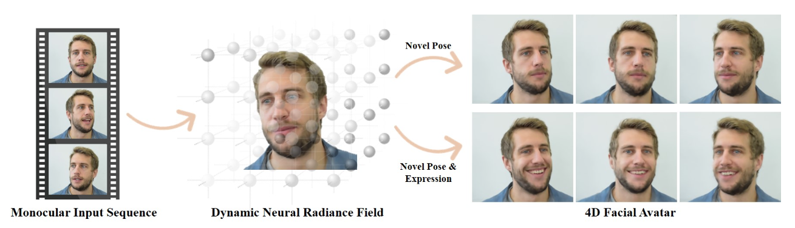
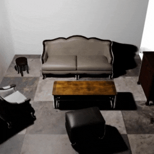

<video width="100%" id="dollyzoom" autoplay="" controls="" muted="" loop="" height="100%">
    <source src="https://storage.googleapis.com/nerf_data/website_renders/depth_reflower.mp4">
</video>

<i>The result that got me hooked on wanting to know everything about NeRF :-).</i>

Besides the COVID-19 pandemic and political upheaval in the US, 2020 was also the year in which **neural volume rendering** exploded onto the scene, triggered by the impressive [NeRF](https://www.matthewtancik.com/nerf) paper by Mildenhall et al.
This blog post is my way of getting up to speed in a fascinating and very young field and share my journey with you; I created it for the express intent to teach this material in a grad computer vision course. To be clear, I have not contributed to any of the papers below. I wish I had, as I stand in awe of the explosion of creative energy around this topic!

To start with some definitions, the larger field of *Neural rendering* is defined by the [excellent review paper by Tewari et al.](https://www.neuralrender.com/assets/downloads/TewariFriedThiesSitzmannEtAl_EG2020STAR.pdf) as 
> "deep image or video generation approaches that enable explicit or implicit control of scene properties such as illumination, camera parameters, pose, geometry, appearance, and semantic structure."

It is a novel, data-driven solution to the long-standing problem in computer graphics of the **realistic rendering of virtual worlds**.

**Neural volume rendering** refers to methods that generate images or video by tracing a ray into the scene and taking an integral of some sort over the length of the ray. Typically a neural network like a multi-layer perceptron encodes a function from the 3D coordinates on the ray to quantities like density and color, which are integrated to yield an image.

**Outline**: Below I first discuss some very relevant related work that lead up to the "NeRF explosion", then discuss the two papers that I think started it all, followed by an annotated bibliography on follow-up work. I am going wide rather than deep, but provide links to all project sites or Arxiv entries, so you can deep-dive yourself. Besides this post, the review paper mentioned above is great background, and Yen-Chen Lin, a PhD student at MIT CSAIL, has curated an [Awesome NeRF repository on GitHub](https://github.com/yenchenlin/awesome-NeRF) with papers, bibtex, and links to some talks.

**Important note**: *all of the images below are reproduced from the cited papers, and the copyright belongs to the authors or the organization that published their papers, like IEEE.  Below I reproduce a key figure for each paper under the fair use clause of copyright law.* 

# The Prelude: Neural Implicit Surfaces

The immediate precursors to neural volume rendering are the approaches that use a neural network to define an **implicit** surface representation. Many 3D-aware image generation approaches used voxels, meshes, point clouds, or other representations, typically based on convolutional architectures. But at CVPR 2019, no less than three papers introduced the use of neural nets as *scalar function approximators* to define occupancy and/or signed distance functions.

## Occupancy networks

[Occupancy networks](https://avg.is.tuebingen.mpg.de/publications/occupancy-networks) is one of two methods at CVPR 2019 that introduce implicit, coordinate-based learning of **occupancy**. A network consisting of 5 ResNet blocks take a feature vector and a 3D point and predict binary occupancy. They also show single-view reconstruction results on real images from KITTI.

> 
> *Occupancy as a learned classifier*.
>
> **Occupancy Networks: Learning 3D Reconstruction in Function Space**, Lars Mescheder, Michael Oechsle, Michael Niemeyer, Sebastian Nowozin, and Andreas Geiger, CVPR 2019.

## IM-Net

[IM-NET](https://github.com/czq142857/implicit-decoder) is the other one, and uses a 6-layer MLP decoder that predicts binary occupancy given a feature vector and a 3D coordinate. The authors show that this "implicit decoder" can be used for auto-encoding, shape generation (GAN-style), and single-view reconstruction.

> 
> *3D Shapes generated using a GAN using IM-NET as the decoder*.
>
> **Learning Implicit Fields for Generative Shape Modeling**, Zhiqin Chen and Hao Zhang, CVPR 2019.

## DeepSDF
Finally, also at CVPR 2019, [DeepSDF](https://github.com/facebookresearch/DeepSDF) directly regresses a **signed distance function** or SDF, rather than binary occupancy, from a 3D coordinate and optionally a latent code. It uses an 8-layer MPL with skip-connections to layer 4 (setting a trend!) that outputs the signed distance.

> 
> *The Stanford bunny rendered through a learned signed distance function (SDF)*.
>
> **DeepSDF: Learning Continuous Signed Distance Functions for Shape Representation**, 	Jeong Joon Park, Peter Florence, Julian Straub, Richard Newcombe, and Steven Lovegrove, CVPR 2019.

## PIFu
Building on this, the ICCV 2019 [PIFu](https://shunsukesaito.github.io/PIFu/) paper showed that it was possible to learn highly detailed implicit models by re-projecting 3D points into a pixel-aligned feature representation. This idea will later be reprised, with great effect, in PixelNeRF.

> 
> *PIFu regresses color and an SDF from pixel aligned features, enabling single-view reconstruction*.
>
> **PIFu: Pixel-Aligned Implicit Function for High-Resolution Clothed Human Digitization**,	Shunsuke Saito, Zeng Huang, Ryota Natsume, Shigeo Morishima, Angjoo Kanazawa, and Hao Li, ICCV 2019.

## Building on Implicit Functions

Several other approaches built on top of the implicit function idea, and generalize to training from 2D images. Of note are Structured Implicit Functions, CvxNet, BSP-Net, Deep Local Shapes, Scene Representation Networks, Differentiable Volumetric Rendering, the Implicit Differentiable Renderer, and NASA.

Also published at ICCV 2019, [Structured Implicit Functions](https://github.com/google/ldif) showed that you can combine these implicit representations, e.g., simply by summing them.
Another way to combine signed distance functions is by taking a pointwise max (in 3D), as done in [CvxNet](https://cvxnet.github.io/), a paper which has a number of other elegant techniques to reconstruct an object from depth or RGB images. 
[BSP-Net](https://bsp-net.github.io/) is in many ways similar to CvxNet, but uses binary space partitioning at its core, yielding a method that outputs polygonal meshes natively, rather than via an expensive meshing method.
Finally, [Deep Local Shapes](https://arxiv.org/abs/2003.10983), store a DeepSDF latent code in a voxel grid as to represent larger, extended scenes.

A [Scene Representation Network or SRN](https://vsitzmann.github.io/srns/) is quite similar to DeepSDF in terms of architecture, but adds a differentiable ray marching algorithm to find the closest point of intersection of a learnt implicit surface, and add an MLP to regress color, enabling it to be learned from multiple posed images.

Similar to the SRN work, the CVPR 2020 [Differentiable Volumetric Rendering](https://github.com/autonomousvision/differentiable_volumetric_rendering) paper shows that an implicit scene representation can be coupled with a differentiable renderer, making it trainable from images. They use the term *volumetric renderer*, but really the main contribution is a clever trick to make the computation of depth to the implicit surface differentiable: no integration over a volume is used.

The [Implicit Differentiable Renderer](https://lioryariv.github.io/idr/) work from Weizmann presented at NeurIPS 2020 is similar, but it has a more sophisticated surface light field representation, and the authors also show that they can refine camera pose during training.

Finally, [Neural Articulated Shape Approximation](https://virtualhumans.mpi-inf.mpg.de/nasa/) or NASA composes implicit functions to represent articulated objects such as human bodies.
# Neural Volume Rendering

As far as I know, two papers introduced **volume rendering** into the view synthesis field, with NeRF being the simplest and ultimately the most influential. 

*A word about naming*: the two papers below and all Nerf-style papers since build upon the work above that encode implicit surfaces, and so the term *implicit neural methods* is used quite a bit. However, I personally associate that term more with level-set representations for curves and surfaces. What they *do* have in common with occupancy/SDF-style networks is that MLP's are used as functions from coordinates in 3D to scalar or multi-variate fields, and hence these methods are also sometimes called **coordinate-based** scene representation networks. Of that larger set, we're concerned with *volume rendering* versions of those below.

## Neural Volumes

AFAIK, true **volume rendering** for view synthesis was introduced in the [Neural Volumes](https://research.fb.com/publications/neural-volumes-learning-dynamic-renderable-volumes-from-images/) paper from Facebook Reality Labs, regressing a 3D volume of density and color, albeit still in a voxel-based representation.

> 
> *In the "Neural Volumes" approach, a latent code is decoded into a 3D volume, and a new image is then obtained by volume rendering*.
>
> **Neural Volumes: Learning Dynamic Renderable Volumes from Images**,	Stephen Lombardi, Tomas Simon, Jason Saragih, Gabriel Schwartz, Andreas Lehrmann, and Yaser Sheikh, Siggraph 2019.

One of the most interesting quotes from this paper hypothesizes about the success of neural volume rendering approaches (emphasis is mine):

> [We] propose using a volumetric representation consisting of opacity and color at each position in 3D space, where rendering is realized through integral projection. During optimization, this semi-transparent representation of geometry disperses gradient in- formation along the ray of integration, **effectively widening the basin of convergence, enabling the discovery of good solutions**.

I think that resonates with many people, and partially explains the success of neural volume rendering. I won't go into any detail about the method itself, but the paper is a great read. Instead, let's dive right into NeRF itself below...

## NeRF 

The paper that got everyone talking was the [Neural Radiance Fields or NeRF paper](https://www.matthewtancik.com/nerf), with three first authors from Berkeley. In essence, they take the DeepSDF architecture but regress not a signed distance function, but density and color. They then use an (easily differentiable) numerical integration method to approximate a true volumetric rendering step. 

The figures below illustrate both the overall setup and some detail about the rendering procedure. 

> 
> A NeRF stores a volumetric scene representation as the weights of an MLP, trained on many images with known pose.
>
> 
> *New views are rendered by integrating the density and color at regular intervals along each viewing ray*.
>
> **NeRF: Representing Scenes as Neural Radiance Fields for View Synthesis**,	Ben Mildenhall*, Pratul Srinivasan*, Matthew Tancik*, Jonathan Barron, Ravi Ramamoorthi, Ren Ng, ECCV 2020.

One of the reasons NeRF is able to render with great detail is because it encodes a 3D point and associated view direction on a ray using periodic activation functions, i.e., [Fourier Features](https://people.eecs.berkeley.edu/~bmild/fourfeat/). This innovation was later generalized to multi-layer networks with periodic activations, aka [SIREN](https://vsitzmann.github.io/siren/) (SInusoidal REpresentation Networks). Both were published later at NeurIPS 2020.

While the NeRF paper was ostensibly published at ECCV 2020, at the end of August, it [first appeared on Arxiv](https://arxiv.org/abs/2003.08934) in the middle of March, sparking an explosion of interest on [twitter](https://twitter.com/ak92501/status/1240802419476508673?s=20). I remember seeing [the video](https://www.youtube.com/watch?v=JuH79E8rdKc) and being amazed at the quality of the synthesized views, but even more so at the incredible detail in the visualized depth maps, e.g., the figure at the top of this post, or this Christmas tree:

<video width="100%" id="dollyzoom" autoplay="" controls="" muted="" loop="" height="100%">
    <source src="https://storage.googleapis.com/nerf_data/website_renders/depth_ornament.mp4">
</video>

It is worth visiting [the (elaborate) project site](https://www.matthewtancik.com/nerf) and looking at all the videos. If you're new to NeRF, prepare to be amazed :-)

Arguably, the impact of the NeRF paper lies in its brutal simplicity: just an MLP taking in a 5D coordinate and outputting density and color. There are some bells and whistles, notably the positional encoding and a stratified sampling scheme, but many researchers were taken aback (I think) that such a simple architecture could yield such impressive results. That being said, vanilla NeRF left many opportunities to improve upon:
- It is *slow*, both for training and rendering.
- It can only represent static scenes
- It "bakes in" lighting
- A trained NeRF representation does not generalize to other scenes/objects

In this Arxiv-fueled computer vision world, these opportunities were almost immediately capitalized on, with almost 25 papers appearing on Arxiv over the past 6 months, the vast majority in the last month even (presumably, a subset of the +10K CVPR submissions). Below I list all of them I could find, and discuss representative papers in each category.

# Performance

Several projects/papers aim at improving the rather slow training and rendering time of the original NeRF paper.

> 
> *Using an octree as an organizing data structure, the NSVF paper claims both Neural Volumes and NeRF as special cases. Feature embeddings on the vertices of each voxel are interpolated and fed to a (smaller) NLP outputting density and color, as in NeRF*.
>
> **Neural Sparse Voxel Fields**,	Lingjie Liu, Jiatao Gu, Kyaw Zaw Lin, Tat-Seng Sua, and Christian Theobalt, NeurIPS 2020.

[Neural Sparse Voxel Fields](https://github.com/facebookresearch/NSVF) (see Figure above) organizes the scene into a sparse voxel octree to speed up rendering by a factor of 10.

[NERF++](https://github.com/Kai-46/nerfplusplus) proposed to model the background with a separate NeRF to handle unbounded scenes.

[DeRF](https://ubc-vision.github.io/derf/) decomposes the scene into "soft Voronoi diagrams" to take advantage of accelerator memory architectures.

[AutoInt](http://www.computationalimaging.org/publications/automatic-integration/) greatly speeds up rendering by learning the volume integral directly. This is an interesting and much more general paper, BTW!

[Learned Initializations](https://arxiv.org/abs/2012.02189) uses meta-learning to find a good weight initialization for faster training.

[JaxNeRF](https://github.com/google-research/google-research/tree/master/jaxnerf) uses JAX (https://github.com/google/jax) to dramatically speed up training, from days to hours.

# Dynamic

At least four efforts focus on dynamic scenes, using a variety of schemes.

<video width="100%" id="dollyzoom" autoplay="" controls="" muted="" loop="" height="100%">
    <source src="https://storage.googleapis.com/nerfies-public/videos/teaser.mp4">
</video>

*Teaser videos from the [Nerfies web-page](https://nerfies.github.io/) showing how a casually captured "selfie video" can be turned into free-viewpoint videos, by fitting a deformation field in addition to the usual NeRF density/color representation*.

[Nerfies](https://nerfies.github.io/) (see video above) and its underlying D-NeRF model deformable videos using a second MLP applying a deformation for each frame of the video.

[Space-Time Neural Irradiance Fields](https://video-nerf.github.io/) simply use time as an additional input. Carefully selected losses are needed to successfully train this method to render free-viewpoint videos (from RGBD data!).

[Neural Scene Flow Fields](http://www.cs.cornell.edu/~zl548/NSFF/) instead train from RGB but use monocular depth predictions as a prior, and regularize by also outputting scene flow, used in the loss.

[D-NeRF](https://www.albertpumarola.com/research/D-NeRF/index.html) is quite similar to the Nerfies paper and even uses the same acronym, but seems to limit deformations to translations.

[NeRFlow](https://yilundu.github.io/nerflow/) is the latest dynamic NeRF variant to appear on Arxiv, and also uses a Nerfies style deformation MLP, with a twist: it integrates scene flow across time to obtain the final deformation.
# Portrait

Besides Nerfies, two other papers focus on avatars/portraits of people.

> 
> *[Dynamic Neural Radiance Fields](https://gafniguy.github.io/4D-Facial-Avatars/) are quite similar to Nerfies in terms of task, but use a morphable face model to simplify training and rendering*.
>
> **Dynamic Neural Radiance Fields for Monocular 4D Facial Avatar Reconstruction**,	Guy Gafni, Justus Thies, Michael Zollhöfer, and Matthias Nießner.

[DNRF](https://gafniguy.github.io/4D-Facial-Avatars/) is focused on 4D avatars and hence impose a strong inductive bias by including a deformable face model into the pipeline. This gives *parametric* control over the dynamic NeRF.

[Portrait NeRF](https://portrait-nerf.github.io/) creates static NeRF-style avatars, but does so from a single RGB headshot. To make this work, light-stage training data is required.

# Relighting

Another dimension in which NeRF-style methods have been augmented is in how to deal with lighting, typically through latent codes that can be used to re-light a scene.

[NeRF-W](https://nerf-w.github.io/) was one of the first follow-up works on NeRF, and optimizes a latent appearance code to enable learning a neural scene representation from less controlled multi-view collections.

[Neural Reflectance Fields](http://cseweb.ucsd.edu/~bisai/) improve on NeRF by adding a local reflection model in addition to density. It yields impressive relighting results, albeit from single point light sources.

[NeRV](https://people.eecs.berkeley.edu/~pratul/nerv/) uses a second "visibility" MLP to support arbitrary environment lighting and "one-bounce" indirect illumination. 

> 
> *NeRD, as other methods in this section, go beyond NeRF in learning more complex local reflectance models along with density. NeRD itself also learns a global illumination model for each scene in the training set , as illustrated in panel d*.
>
> **NeRD: Neural Reflectance Decomposition from Image Collections**,	Mark Boss, Raphael  Braun, Varun Jampani, Jonathan Barron, Ce Liu, and Hendrik Lensch.

[NeRD](https://markboss.me/publication/2021-nerd/) or “Neural Reflectance Decomposition” is another effort in which a local reflectance model is used, and additionally a low-res spherical harmonics illumination is inferred for a given scene.

# Shape

Latent codes can also be used to encode shape priors.

> 
> *GRAF (and other conditional variants of NeRF) add latent codes for shape and/or appearance, so neural volume rendering can be used in generative fashion, as well as inference*.
>
> **GRAF: Generative Radiance Fields for 3D-Aware Image Synthesis**,	Katja Schwarz, Yiyi Liao, Michael Niemeyer, Andreas Geiger.

[GRAF](https://autonomousvision.github.io/graf/) i.e., a “Generative model for RAdiance Fields"is a conditional variant of NeRF, adding both appearance and shape latent codes, while viewpoint invariance is obtained through GAN-style training.

[pi-GAN](https://marcoamonteiro.github.io/pi-GAN-website/) Is similar to GRAF but uses a SIREN-style implementation of NeRF, where each layer is modulated by the output of a different MLP that takes in a latent code.

[pixelNeRF](https://github.com/sxyu/pixel-nerf) is closer to image-based rendering, where N images are used at test time. It is based on PIFu, creating pixel-aligned features that are then interpolated when evaluating a NeRF-style renderer.

[GRF](https://github.com/alextrevithick/GRF) is pretty close to pixelNeRF in setup, but operates in a canonical space rather than in view space.
# Composition

Clearly (?) none of this will scale to large scenes composed of many objects, so an exciting new area of interest is how to compose objects into volume-rendered scenes.

[Neural Scene Graphs](https://arxiv.org/abs/2011.10379) supports several object-centric NeRF models in a scene graph.

[STaR](https://wentaoyuan.github.io/star/) is similar to the Neural Scene Graphs paper, limited to a single object, but not requiring pose supervision at training time.

[GIRAFFE](https://arxiv.org/abs/2011.12100) supports composition by having object-centric NeRF models output feature vectors rather than color, then compose via averaging, and render at low resolution to 2D feature maps that are then upsampled in 2D.

> 
>
> *Object scattering functions (OSFs) were proposed in a very recent paper to support composing scenes with arbitrary object positions (left) and lighting (right)*.
>
> **Object-Centric Neural Scene Rendering**,	Michelle Guo, Alireza Fathi, Jiajun Wu, and Thomas Funkhouser

[Object-Centric Neural Scene Rendering](https://shellguo.com/osf/) learns "Object Scattering Functions" in object-centric coordinate frames, allowing for composing scenes and realistically lighting them, using Monte Carlo rendering.

# Pose Estimation

Finally, at least one paper has used NeRF rendering in the context of (known) object pose estimation.

> 
> *The [iNeRF](http://yenchenlin.me/inerf/) teaser GIF: iNERF uses NeRF as a synthesis model in a pose optimizer*.
>
> **iNeRF: Inverting Neural Radiance Fields for Pose Estimation**,	Lin Yen-Chen, Peter Florence, Jonathan Barron, Alberto Rodriguez, Phillip Isola, and Tsung-Yi Lin.

[iNeRF](http://yenchenlin.me/inerf/) uses a NeRF MLP in a pose estimation framework, and is even able to improve view synthesis on standard datasets by fine-tuning the poses. However, it does not yet handle illumination.

# Concluding Thoughts

Neural Volume Rendering and NeRF-style papers have exploded on the scene in 2020, and the last word has not been said. This post definitely does not rise to the level of a thorough review, but I hope that this "explosition" is useful for people working in this area or thinking of joining the fray.

However, if I may venture an opinion, it is far from clear -even in the face of all this excitement- that neural *volume* rendering is going to carry the day in the end. While the real world *does* have haze, smoke, transparencies, etcetera, in the end most of the light is scattered into our eyes from *surfaces*. NeRF-style networks might be easily trainable because of their volume-based approach, but I already see a trend where authors are trying to discover or guess the surfaces after convergence. In fact, the stratified sampling scheme in the original NeRF paper is exactly that. Hence, as we learn from the NeRF explosion I can easily see the field moving back to SDF-style implicit representations or even voxels, at least at inference time.

I want to conclude by giving a shoutout to the **152** authors of the papers I mentioned above: 
Matan Atzmon, 
Jonathan Barron, 
Ronan Basri, 
Mojtaba Bemana, 
Alexander Bergman, 
Sai Bi, 
Mark Boss, 
Sofien Bouaziz, 
Raphael Braun, 
Rohan Chabra, 
Eric Chan, 
Zhiqin Chen, 
Forrester Cole, 
Enric Corona, 
Boyang Deng, 
Alexey Dosovitskiy, 
Yilun Du, 
Daniel Duckworth, 
Alireza Fathi, 
Pete Florence, 
William Freeman, 
Thomas Funkhouser, 
Guy Gafni, 
Meirav Galun, 
Chen Gao, 
Andreas Geiger, 
Kyle Genova, 
Dan Goldman, 
Vladislav Golyanik, 
Jiatao Gu, 
Michelle Guo, 
Miloš Hašan, 
Felix Heide, 
Geoffrey Hinton, 
Yannick Hold-Geoffroy, 
Zeng Huang, 
Jia-Bin Huang, 
Eddy Ilg, 
Phillip Isola, 
Varun Jampani, 
Timothy Jeruzalski, 
Wei Jiang, 
Angjoo Kanazawa, 
Yoni Kasten, 
Peter Kellnhofer, 
Changil Kim, 
Julian Knodt, 
Vladlen Koltun, 
Johannes Kopf, 
David Kriegman, 
Wei-Sheng Lai, 
Christoph Lassner, 
Andreas Lehrmann, 
Hendrik Lensch, 
Jan Lenssen, 
JP Lewis, 
Zhengqi Li, 
Ke Li, 
Hao Li, 
Chia-Kai Liang, 
Yiyi Liao, 
Kyaw Zaw Lin, 
Tsung-Yi Lin, 
David Lindell, 
Yaron Lipman, 
Lingjie Liu, 
Ce Liu, 
Stephen Lombardi, 
Steven Lovegrove, 
Zhaoyang Lv, 
Fahim Mannan, 
Julien Martel, 
Ricardo Martin-Brualla, 
Lars Mescheder, 
Ben Mildenhall, 
Marco Monteiro, 
Dror Moran, 
Francesc Moreno-Noguer, 
Shigeo Morishima, 
Karol Myszkowski, 
Ryota Natsume, 
Richard Newcombe, 
Ren Ng, 
Michael Niemeyer, 
Matthias Nießner, 
Simon Niklaus, 
Mohammad Norouzi, 
Sebastian Nowozin, 
Michael Oechsle, 
Julian Ost, 
Lionel Ott, 
Jeong Joon Park, 
Keunhong Park, 
Gerard Pons-Moll, 
Albert Pumarola, 
Noha Radwan, 
Ravi Ramamoorthi, 
Fabio Ramos, 
Daniel Rebain, 
Gernot Riegler, 
Tobias Ritschel, 
Alberto Rodriguez, 
Shunsuke Saito, 
Mehdi Sajjadi, 
Jason Saragih, 
Aaron Sarna, 
Divi Schmidt, 
Tanner Schmidt, 
Gabriel Schwartz, 
Katja Schwarz, 
Hans-Peter Seidel, 
Steven Seitz, 
Yaser Sheikh, 
Yichang Shih, 
Tomas Simon, 
Utkarsh Sinha, 
Vincent Sitzmann, 
Noah Snavely, 
Pratul Srinivasan, 
Julian Straub, 
Tat-Seng Sua, 
Kalyan Sulkavalli, 
Andrea Tagliasacchi, 
Matthew Tancik, 
Joshua Tenenbaum, 
Ayush Tewari, 
Christian Theobalt, 
Justus Thies, 
Nils Thürey, 
Edgar Tretschk, 
Alex Trevithick, 
Daniel Vlasic, 
Oliver Wang, 
Terrence Wang, 
Gordon Wetzstein, 
Jiajun Wu, 
Wenqi Xian, 
Zexiang Xu, 
Bo Yang, 
Lior Yariv, 
Soroosh Yazdani, 
Vickie Ye, 
Lin Yen-Chen, 
Kwang Moo Yi, 
Alex Yu, 
Hong-Xing Yu, 
Wentao Yuan, 
Hao Zhang, 
Kai Zhang, 
Xiuming Zhang, 
Yinan Zhang, and
Michael Zollhöfer.