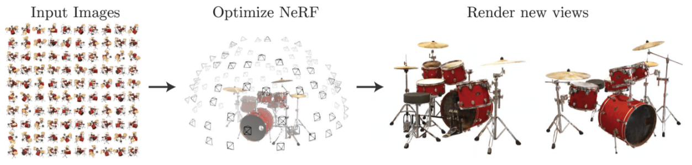

In anticipation of ICCV (Intl. Conf. on Computer Vision) this week, I rounded up all papers that use Neural Radiance Fields (NeRFs) that will be represented in the main #ICCV2021 conference.
Many of the papers I discussed in my [original blog-post on NerF](https://dellaert.github.io/NeRF/) made it into CVPR, but the sheer number of NeRF-style papers that appeared on Arxiv this year meant I could no longer keep up.
The top Computer Vision conferences like ICCV and CVPR provide an (imperfect) filter to cut down on what to read, and I decided to read all the papers I could find in the [ICCV main program](https://iccv2021.thecvf.com/presentation-schedule). I share them with you below, after a brief review of NeRF.

**Important note**: *all of the images below are reproduced from the cited papers, and the copyright belongs to the authors or the organization that published their papers, like IEEE.  Below I reproduce a key figure for some papers under the fair use clause of copyright law.* 

## NeRF 

A NeRF stores a volumetric scene representation as the weights of an MLP, trained on many images with known pose.

NeRF was introduced in the (recent but already seminal) [Neural Radiance Fields paper](https://www.matthewtancik.com/nerf) by Mildenhall et al. at ECCV 2020. Given a set of *posed* images, a NeRF model regresses density and color in a 3D volume using a multi-layer perceptron (MLP), that becomes a representation of the 3D scene. One can then use an easily differentiable numerical integration method to approximate a true volumetric rendering step. 

As I have argued, the impact of the NeRF paper lies in its brutal simplicity: just an MLP taking in a 5D coordinate and outputting density and color. However, vanilla NeRF left many opportunities to improve upon:
- It is *slow*, both for training and rendering.
- It can only represent static scenes
- It "bakes in" lighting
- A trained NeRF representation does not generalize to other scenes/objects

Some of the early efforts to improve on NeRF are chronicled on my [NeRF Explosion 2020](https://dellaert.github.io/NeRF/) blog post. In a follow-up on that post, below are all the papers at ICCV'21 that I could find by scanning titles and reading the associated papers.

# Fundamentals

Several projects/papers address the fundamentals of view-synthesis with NeRF-like methods in the original, fully-posed multi-view setup:

[Mip-NeRF](https://jonbarron.info/mipnerf/) address the severe aliasing artifacts from vanilla NeRF by adapting the mip-map idea from graphics and replacing sampling the light field by integrating over conical sections along a the viewing rays.

[MVSNeRF](https://apchenstu.github.io/mvsnerf/) trains a model across many scenes and then  renders new views conditioned on only a few posed input views, using intermediate voxelized features that encode the volume to be rendered.

[DietNeRF](https://arxiv.org/abs/2104.00677) is a very out-of-the box method that supervises the NeRF training process by a semantic loss, created by evaluating arbitrary views using CLIP, so it can learn a NeRF from a single view for arbitrary categories.

[UNISURF](https://arxiv.org/abs/2104.10078) propose to replace the density in NeRF with occupancy, and hierarchical sampling with root-finding, allowing to do both volume and surface rendering for much improved geometry.

[NerfingMVS](https://weiyithu.github.io/NerfingMVS/) use a sparse depth map from an SfM pipeline to train a scene-specific depth network that subsequently guides the adaptive sampling strategy in NeRF.

# Performance

The slow rendering/training of NeRF prompted many more papers on speeding up NeRf, mostly focused on rendering:

[FastNeRF](https://arxiv.org/abs/2103.10380) factorizes the NeRF volume rendering equation into two branches that are combined to give the same results as NeRF, but allow for much more efficient caching, yielding a 3000x speed up.

[KiloNeRF](https://github.com/creiser/kilonerf) replaces a single large NeRF-MLP with thousands of tiny MLPs, accelerating rendering by 3 orders of magnitude.

[PlenOctrees](https://alexyu.net/plenoctrees/) introduce NeRF-SH that uses spherical harmonics to model view-dependent color, and then compresses that into a octree-like data-structure for rendering the result 3000 faster than NeRF.

[SNeRG](https://arxiv.org/abs/2103.14645) precompute and "bake" a NeRF into a new Sparse Neural Radiance Grid (SNeRG) representation, enabling real-time rendering.

[RtS](https://arxiv.org/abs/2108.04886) focuses on rendering derivatives efficiently and correctly for a variety of surface representations, including NeRF, using a fast "Surface NeRF" or sNerF renderer.

# Pose-free

Another trend is to remove the need for (exact) pose supervision, which started with 'NeRF--' (on Arxiv), and is done by no less than three papers at ICCV:

[BARF](https://chenhsuanlin.bitbucket.io/bundle-adjusting-NeRF/) optimizes for the scene and the camera poses simultaneously, as in "bundle adjustment", in a coarse-to-fine manner.

[SCNeRF](https://postech-cvlab.github.io/SCNeRF/) is similar to BARF, but additionally optimizes over intrinsics, including radial distortion and per-pixel non-linear distortion.

[GNeRF](https://arxiv.org/abs/2103.15606) distinguishes itself from other the pose-free NeRF efforts by virtue of a "rough initial pose" network, which uses GAN-style training a la GRAF, which solves the (hard) initialization problem.

# Conditional

One of the largest areas of activity, at least in terms of number of papers, is conditioning NeRF-like models on various latent codes:

[GRF](https://github.com/alextrevithick/GRF) is, like PixelNeRF and IBRNet at CVPR, closer to image-based rendering, where only a few images are used at test time. Unlike PixelNeRF GRF operates in a canonical space rather than in view space.

[GSN](https://apple.github.io/ml-gsn/) is a generative model for *scenes*: it takes a global code that is translated into a grid of local codes, each associated with a local radiance model. A small convnet helps upscaling the final output.

[GANcraft](https://nvlabs.github.io/GANcraft/) translates a semantic block world into a set of voxel-bound NeRF-models that allows rendering of photorealistic images corresponding to this “Minecraft” world, additionally conditioned a style latent code.

[CodeNeRF](https://sites.google.com/view/wbjang/home/codenerf) Trains a GRAF-style conditional NeRF (a shape and appearance latent code) and then optimizes at inference time over both latent codes *and* the object pose.

# Composition

Conditional NeRFs are the bread and butter of efforts that do various cool things with composing scenes:

[EditNeRF](http://editnerf.csail.mit.edu/) learns a category-specific conditional NeRF model, inspired by GRAF but with an instance-agnostic branch, and show a variety of strategies to edit both color and shape interactively.

[ObjectNeRF](https://zju3dv.github.io/object_nerf/) trains a voxel embedding feeding two pathways: scene and objects. By modifying the voxel embedding the objects can be moved, cloned, or removed.

# Dynamic

At least four efforts focus on dynamic scenes, using a variety of schemes, including some that I already discussed earlier:

<video width="100%" id="dollyzoom" autoplay="" controls="" muted="" loop="" height="100%">
    <source src="https://homes.cs.washington.edu/~kpar/nerfies/videos/teaser.mp4">
</video>

*Teaser videos from the [Nerfies web-page](https://nerfies.github.io/) showing how a casually captured "selfie video" can be turned into free-viewpoint videos, by fitting a deformation field in addition to the usual NeRF density/color representation*.

[Nerfies](https://nerfies.github.io/) and its underlying D-NeRF model deformable videos using a second MLP applying a deformation for each frame of the video.

[NeRFlow](https://yilundu.github.io/nerflow/) is a concurrent effort, which learns "a single consistent continuous spatial-temporal radiance field that is constrained to generate consistent 4D view synthesis across both space and time".

[NR-NeRF](https://vcai.mpi-inf.mpg.de/projects/nonrigid_nerf/) also uses a deformation MLP to model non-rigid scenes. It has no reliance on pre-computed scene

[AD-NeRF](https://yudongguo.github.io/ADNeRF/) train a conditional nerf from a short video with audio, concatenating DeepSpeech features and head pose to the input, enabling new audio-driven synthesis as well as editing of the input clip.

[DynamicVS](https://free-view-video.github.io) is attacking the very challenging free-viewpoint video synthesis problem, and uses scene-flow prediction along with *many* regularization results to produce impressive results.

# Articulated

Building on this, a cool trend is skeleton-driven NeRFs, that promise to be useful for animating avatars and the like:

<video width="100%" id="dollyzoom" autoplay="" controls="" muted="" loop="" height="100%">
    <source src="https://zju3dv.github.io/animatable_nerf/images/teaser.m4v">
</video>

[NARF](https://github.com/nogu-atsu/NARF) use pose supervision to train a small *local* occupancy network per articulated part, which is then used to modulate a conditionally trained NeRF model.

[AnimatableNeRF](https://zju3dv.github.io/animatable_nerf/) use a tracked skeleton from mocap data and multi-view video to train skeleton-based blend-fields that then transform the radiance field, enabling skeleton-driven synthesis of people's avatars.

# Other

Finally, here are some other very cool papers using NeRF-technology that defy easy categorization:

[IMAP](https://edgarsucar.github.io/iMAP/) is an awesome paper that uses NeRF as the scene representation in an online visual SLAM system, learning a 3D scene online and tracking a moving camera against it.

[MINE](https://vincentfung13.github.io/projects/mine/) learns to predict a density/color multi-plane representation, conditioned on a single image, which can then be used for NeRF-style volume rendering.

<video width="100%" id="dollyzoom" autoplay="" controls="" muted="" loop="" height="100%">
    <source src="https://shuaifengzhi.com/Semantic-NeRF/img/VS_room2.mp4">
</video>

[Semantic-NERF](https://shuaifengzhi.com/Semantic-NeRF/) add a segmentation renderer before injecting viewing directions into NeRF and generate high resolution semantic labels for a scene with only partial, noisy or low-resolution semantic supervision.

[CO3D](https://github.com/facebookresearch/co3d) contributes an *amazing* dataset of annotated object videos, and evaluates 15 methods on single-scene reconstruction and learning 3D object categories, including a new SOTA “NerFormer” model.

Finally, [CryoDRGN2](https://openaccess.thecvf.com/content/ICCV2021/html/Zhong_CryoDRGN2_Ab_Initio_Neural_Reconstruction_of_3D_Protein_Structures_From_ICCV_2021_paper.html) attacks the challenging problem of reconstructing protein structure *and* pose from a "multiview" set of cryo-EM *density* images. It is unique among NeRF-style papers as it works in the Fourier domain.

# Agenda for ICCV
For people attending ICCV, here is a quick guide to all the sessions where the papers above will be presented:
## Session 3

*Paper Session 3A and 3B: Tuesday, October 12 12:00 PM – 1:00 PM and  Thursday, October 14, 7:00 PM – 8:00 PM*
- [CryoDRGN2](https://openaccess.thecvf.com/content/ICCV2021/html/Zhong_CryoDRGN2_Ab_Initio_Neural_Reconstruction_of_3D_Protein_Structures_From_ICCV_2021_paper.html): CryoDRGN2: Ab initio neural reconstruction of 3D protein structures from real cryo-EM images (Other)

## Session 5

*Paper Session 5A and 5B: Tuesday, October 12, 4:00 PM – 5:00 PM and  Thursday, October 14, 9:00 AM – 10:00 AM*
- [Mip-NeRF](https://jonbarron.info/mipnerf/): Mip-NeRF: A Multiscale Representation for Anti-Aliasing Neural Radiance Fields (Fundamentals)
- [DietNeRF](https://arxiv.org/abs/2104.00677): Putting NeRF on a Diet: Semantically Consistent Few-Shot View Synthesis (Fundamentals)
- [UNISURF](https://arxiv.org/abs/2104.10078): UNISURF: Unifying Neural Implicit Surfaces and Radiance Fields for Multi-View Reconstruction (Fundamentals)
- [NerfingMVS](https://weiyithu.github.io/NerfingMVS/): NerfingMVS: Guided Optimization of Neural Radiance Fields for Indoor Multi-View Stereo (Fundamentals)
- [GNeRF](https://arxiv.org/abs/2103.15606): GNeRF: GAN-Based Neural Radiance Field Without Posed Camera (Pose-free)
- [BARF](https://chenhsuanlin.bitbucket.io/bundle-adjusting-NeRF/): BARF: Bundle-Adjusting Neural Radiance Fields (Pose-free)
- [SCNeRF](https://postech-cvlab.github.io/SCNeRF/): Self-Calibrating Neural Radiance Fields (Pose-free)
- [PlenOctrees](https://alexyu.net/plenoctrees/): PlenOctrees for Real-Time Rendering of Neural Radiance Fields (Performance)
- [SNeRG](https://arxiv.org/abs/2103.14645): Baking Neural Radiance Fields for Real-Time View Synthesis (Performance)
- [RtS](https://arxiv.org/abs/2108.04886): Differentiable Surface Rendering via Non-Differentiable Sampling (Performance)
- [EditNeRF](http://editnerf.csail.mit.edu/): Editing Conditional Radiance Fields (Composition)
- [Nerfies](https://nerfies.github.io/): Nerfies: Deformable Neural Radiance Fields (Dynamic)
- [AD-NeRF](https://yudongguo.github.io/ADNeRF/): AD-NeRF: Audio Driven Neural Radiance Fields for Talking Head Synthesis (Dynamic)
- [DynamicVS](https://free-view-video.github.io): Dynamic View Synthesis from Dynamic Monocular Video (Dynamic)
- [NARF](https://github.com/nogu-atsu/NARF): Neural Articulated Radiance Field (Articulated)
- [IMAP](https://edgarsucar.github.io/iMAP/): iMAP: Implicit Mapping and Positioning in Real-Time (Other)

## Session 8

*Paper Session 8A and 8B: Wednesday, October 13, 9:00 AM – 10:00 AM and  Friday, October 15, 4:00 PM – 5:00 PM*
- [CO3D](https://github.com/facebookresearch/co3d): Common Objects in 3D:
Large-Scale Learning and Evaluation of Real-life 3D Category Reconstruction (Other)

## Session 10

*Paper Session 10A and 10B: Wednesday, October 13, 5:00 PM – 6:00 PM and  Friday, October 15, 10:00 AM – 11:00 AM*
- [CodeNeRF](https://sites.google.com/view/wbjang/home/codenerf): CodeNeRF: Disentangled Neural Radiance Fields for Object Categories (Conditional)
- [NR-NeRF](https://vcai.mpi-inf.mpg.de/projects/nonrigid_nerf/): Non-Rigid Neural Radiance Fields: Reconstruction and Novel View Synthesis of a Deforming Scene from Monocular Video (Dynamic)
- [MINE](https://vincentfung13.github.io/projects/mine/): MINE: Towards Continuous Depth MPI With NeRF for Novel View Synthesis (Other)

## Session 11

*Paper Session 11A and 11B: Wednesday, October 13, 6:00 PM – 7:00 PM and  Friday, October 15,11:00 AM – 12:00 PM*
- [MVSNeRF](https://apchenstu.github.io/mvsnerf/): MVSNeRF: Fast Generalizable Radiance Field Reconstruction From Multi-View Stereo (Fundamentals)
- [FastNeRF](https://arxiv.org/abs/2103.10380): FastNeRF: High-Fidelity Neural Rendering at 200FPS (Performance)
- [KiloNeRF](https://creiser.github.io/kilonerf/): KiloNeRF: Speeding Up Neural Radiance Fields With Thousands of Tiny MLPs (Performance)
- [GSN](https://apple.github.io/ml-gsn/): Unconstrained Scene Generation With Locally Conditioned Radiance Fields (Conditional)
- [GANcraft](https://nvlabs.github.io/GANcraft/): GANcraft: Unsupervised 3D Neural Rendering of Minecraft Worlds (Conditional)
- [ObjectNeRF](https://zju3dv.github.io/object_nerf/): Learning Object-Compositional Neural Radiance Field for Editable Scene Rendering (Composition)
- [NeRFlow](https://yilundu.github.io/nerflow/): Neural Radiance Flow for 4D View Synthesis and Video Processing (Dynamic)
- [AnimatableNeRF](https://zju3dv.github.io/animatable_nerf/): Animatable Neural Radiance Fields for Modeling Dynamic Human Bodies (Articulated)

## Session 12

*Paper Session 12A and 12B: Wednesday, October 13, 7:00 PM – 8:00 PM and  Friday, October 15, 12:00 PM – 1:00 PM*
- [GRF](https://github.com/alextrevithick/GRF): GRF: Learning a General Radiance Field for 3D Scene Representation and Rendering (Conditional)
- [Semantic-NERF](https://shuaifengzhi.com/Semantic-NeRF/): In-Place Scene Labelling and Understanding with Implicit Scene Representation (Other)

# Concluding Thoughts

It is clear that neural radiance fields have created somewhat of a revolution in the areas 3D representation and view-synthesis, as evidenced by the 30+ papers above in a single conference, merely a year after the NeRF paper was published at ECCV. I have no "deep" thoughts to share about this at the moment, but I hope you at least enjoyed the rundown above!